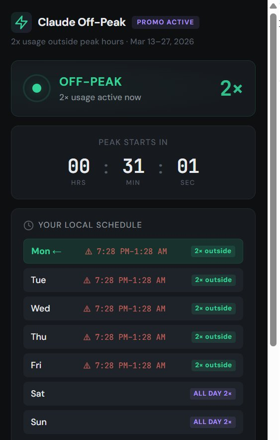
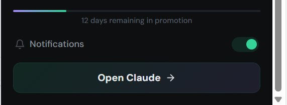

<div align="center">

# ⚡ Claude Off-Peak Timer

### **Maximize Your 2× Claude Usage — Never Miss Off-Peak Hours**

<p align="center">
  <strong>Auto Timezone · Live Status · Countdown · Smart Notifications</strong>
</p>

<p align="center">
  <a href="#-install-2-minutes"></a>
  <a href="#-also-works-on"></a>
  <a href="#-also-works-on"></a>
  <a href="LICENSE"></a>
</p>

<p align="center">
  
  
  
  
</p>

---




---

**[⬇️ Download](#-install-2-minutes)** · **[✨ Features](#-features)** · **[📋 Promo Details](#-promotion-details)** · **[🔒 Privacy](#-privacy)**

---

</div>

## 🎯 **What is this?**

During **Anthropic's March 2026 promotion** (March 13–27), Claude users get **double usage** during off-peak hours. But tracking when off-peak starts in **your timezone** is annoying — especially if you're not in the US.

**Claude Off-Peak Timer** solves this. One click on your toolbar and you know exactly:

- 🟢 Are you in off-peak right now? → **Yes, go wild with 2×**
- 🔴 Is it peak hours? → **Timer shows when 2× comes back**
- 📅 What does the schedule look like this week in **your local time**?

---

## ✨ **Features**

<table>
<tr>
<td width="50%">

### 🟢 **Live Status**
Glowing pulse indicator instantly shows off-peak (2×) or peak (1×). No guessing, no timezone math.

### 🌍 **Auto Timezone Detection**
Detects your timezone automatically. Converts the ET schedule to your local time — Jakarta, Tokyo, London, anywhere.

### ⏱️ **Countdown Timer**
Real-time countdown to the next transition. Plan your Claude sessions around maximum usage.

</td>
<td width="50%">

### 🔔 **Smart Notifications**
- Alert when off-peak hours **start**
- 5-minute warning before peak hours **begin**
- Toggle on/off anytime

### 📅 **Weekly Schedule**
Full 7-day view with today highlighted. Weekdays show peak windows, weekends show ALL DAY 2×.

### 📊 **Promo Progress**
Visual progress bar showing how many days remain in the promotion.

</td>
</tr>
</table>

---

## 📥 **Install (2 minutes)**

### **Step 1 — Download**

**Option A:** Click the green **Code** button above → **Download ZIP**

**Option B:** Go to **[Releases](../../releases)** → Download the latest `.zip`

**Option C:** Clone it
```bash
git clone https://github.com/revengerrr/claude-offpeak-timer.git
```

### **Step 2 — Load in Chrome**

| Step | Action |
|------|--------|
| 1 | Open `chrome://extensions/` in your browser |
| 2 | Enable **Developer mode** (toggle top-right) |
| 3 | Click **Load unpacked** |
| 4 | Select the folder containing `manifest.json` |
| 5 | Click the ⚡ icon in your toolbar — done! |

> 💡 **Tip:** If you downloaded the ZIP, make sure to **unzip/extract first** before loading.

---

## 🌐 **Also works on**

Not just Chrome — any Chromium-based browser works:

| Browser | Extensions URL |
|---------|---------------|
| **Chrome** | `chrome://extensions/` |
| **Brave** | `brave://extensions/` |
| **Edge** | `edge://extensions/` |
| **Opera** | `opera://extensions/` |
| **Vivaldi** | `vivaldi://extensions/` |
| **Arc** | Same as Chrome |

Same steps: Developer mode → Load unpacked → Select folder.

---

## 📋 **Promotion Details**

> Source: [Anthropic Support — Claude March 2026 usage promotion](https://support.anthropic.com/en/articles/11003270-claude-march-2026-usage-promotion)

### **Schedule**

| Time Window | Weekdays | Weekends |
|---|---|---|
| **8 AM – 2 PM ET** | Peak (1× normal) | ✅ Off-peak (2×) |
| **All other hours** | ✅ Off-peak (2×) | ✅ Off-peak (2×) |

### **Key Info**

| Detail | Info |
|--------|------|
| **Period** | March 13 – March 27, 2026 |
| **Benefit** | 2× five-hour usage during off-peak |
| **Peak hours** | 8 AM – 2 PM ET / 5 – 11 AM PT on weekdays |
| **Bonus usage** | Does **NOT** count against weekly limits |
| **Eligible plans** | Free, Pro, Max, Team |
| **Excluded** | Enterprise plans |

### **Applies to**

- ✅ Claude (web, desktop, mobile)
- ✅ Cowork
- ✅ Claude Code
- ✅ Claude for Excel
- ✅ Claude for PowerPoint

---

## 🔒 **Privacy**

**Zero data collection.** We take this seriously:

| Concern | Answer |
|---------|--------|
| Personal data collected? | **None** |
| Network requests? | **Zero** — fully offline after install |
| Analytics / tracking? | **None** |
| Cookies? | **None** |
| Data shared with third parties? | **Never** |
| What IS stored locally? | Your notification on/off preference — that's it |

The extension uses your browser's `Intl.DateTimeFormat` API for timezone detection. This runs entirely in your browser — no data leaves your device.

**[📄 Full Privacy Policy →](privacy-policy.html)**

---

## 🛠️ **Tech Stack**

| Component | Technology |
|-----------|-----------|
| **Extension** | Chrome Manifest V3 |
| **Language** | Vanilla JavaScript — no frameworks, no build step |
| **Background** | Service Worker (alarms & notifications) |
| **Storage** | `chrome.storage.local` (notification preference only) |
| **Styling** | CSS custom properties, dark theme |
| **Fonts** | DM Sans + JetBrains Mono |

---

## 🗂️ **Project Structure**

```
claude-offpeak-timer/
├── manifest.json          # Extension config (Manifest V3)
├── popup.html             # Main popup UI
├── popup.css              # Dark theme styling
├── popup.js               # Status, countdown, schedule logic
├── background.js          # Service worker for notifications
├── privacy-policy.html    # Privacy policy page
├── README.md
├── LICENSE
├── .gitignore
│
├── icons/
│   ├── icon16.png
│   ├── icon32.png
│   ├── icon48.png
│   └── icon128.png
│
└── store-assets/
    ├── preview-main.png
    ├── preview-bottom.png
    ├── screenshot-1280x800.png
    ├── promo-tile-440x280.png
    └── marquee-1400x560.png
```

---

## 🤝 **Contributing**

Found a timezone bug? Want to add a feature? PRs welcome!

```bash
# 1. Fork this repo
# 2. Create your branch
git checkout -b fix/timezone-edge-case

# 3. Make your changes
# 4. Commit
git commit -m "Fix timezone offset for DST transition"

# 5. Push & create PR
git push origin fix/timezone-edge-case
```

---

## 📜 **License**

MIT — do whatever you want with it.

---

<div align="center">

### **Built with ⚡ by [@ClawdSign](https://x.com/ClawdSign)**

**If this saved you time, star the repo ⭐**

---

**[⬇️ Download](../../releases)** · **[🐛 Report Bug](../../issues)** · **[💡 Request Feature](../../issues)**

</div>
